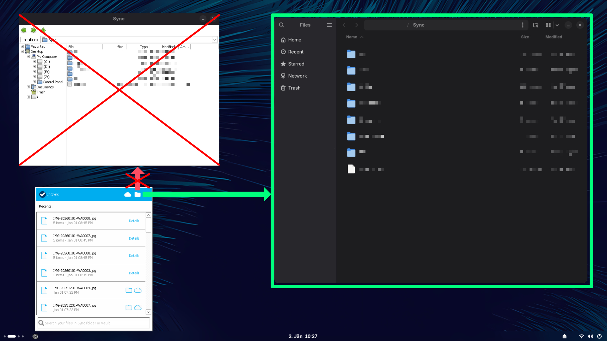

# Explorer.exe Redirect for Wine

**Tired of your Wine apps opening the winefile explorer instead of your system's default file manager?**

Redirect `explorer.exe` calls for opening and selecting folders/files to a native file manager inside a Wine prefix with these scripts.

Tested with the [NonCloudFiles version of the Sync.com client](https://appdb.winehq.org/objectManager.php?sClass=application&iId=17380) and **should support other programs**. 
After following the install instructions, your Sync.com client (or other software if supported) will open folders and select files in your native file manager.

## How it Works
An alternative `explorer.exe` is used. If it is called from another program to open a folder or to select a file, it will redirect that call to the native file manager. Otherwise, it will fallback to the original `explorer.exe`.

Specifically, the redirect invokes explorer-redirect/redirect-path which is a bash script receiving the filepath (already a Unix path at that point) and the optional select instruction.

## Install Instructions

> [!NOTE]
> Installation is per wine prefix.

1. Download and extract the latest release (if you don't have it already). 
2. Copy the explorer-redirect folder into the root folder of your wine prefix (next to the drive_c folder, not into it).
3. Place the `explorer.exe` in one of these two ways:
    - Put it in the program folder of a certain program that should use this `explorer.exe` instead (not every program may support this, but works for Sync.com client for example when put in `C:\Program Files (x86)\Sync`).
    - Backup the original `C:\windows\explorer.exe` and then replace it with this `explorer.exe` and set the environment variable `EXPLORER_REDIRECT_FALLBACK` to the Windows path pointing to your backup of the original `C:\windows\explorer.exe` before running Wine.
4. You may need to add a dot character to `HKEY_LOCAL_MACHINE\System\CurrentControlSet\Control\Session Manager\Environment\PATHEXT` in the registry of your prefix as explained [here](https://gitlab.winehq.org/wine/wine/-/wikis/FAQ#how-do-i-launch-native-applications-from-a-windows-application), so Wine can launch native applications.
5. Now, whenever Wine attempts to open a folder or select a file, your native file manager should open instead!

## Troubleshooting

**If your system struggles to open the internal file manager:**

Try to modify the explorer-redirect/redirect-path script so it simply calls your file manager. The script receives an optional --select as parameter and the file path as the other parameter.
With some knowledge of bash scripts it should be straight forward to adjust it to your needs. 

**If Wine struggles to use the custom `explorer.exe`:**

Try to modify the function `execute_fallback_command` in `explorer-adapter/explorer-adapter.c` and tinker how to invoke the original `explorer.exe` in a different way if needed.
Then rebuild as instructed in the [Build Instructions](#Build-Instructions).

## Build Instructions

1. Install prerequisites winegcc and mingw-w64-gcc (e.g. on Arch with `pacman -S winegcc mingw-w64-gcc`)
2. Modify the `explorer-adapter/explorer-adapter.c` so it fits your needs.
3. Compile it using `explorer-adapter/build-explorer-adapter.sh` (make sure you are in the same folder) to get the new `explorer.exe`.
4. Follow the [Install Instructions](#Install-Instructions) using your new `explorer.exe`.
